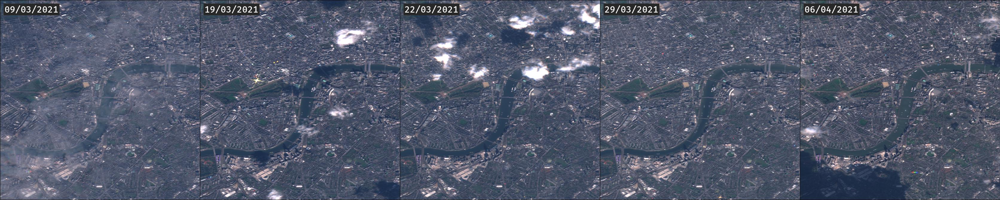
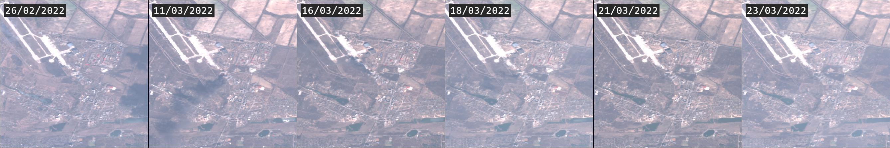
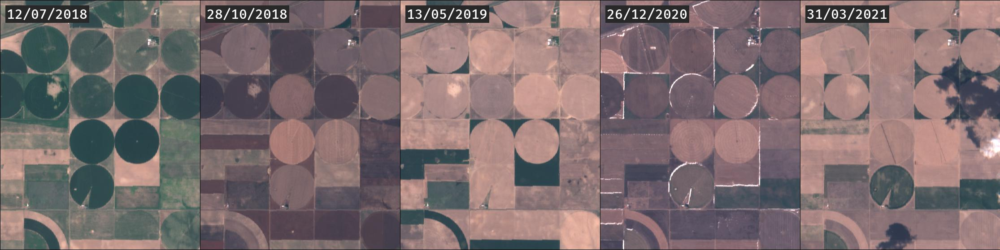
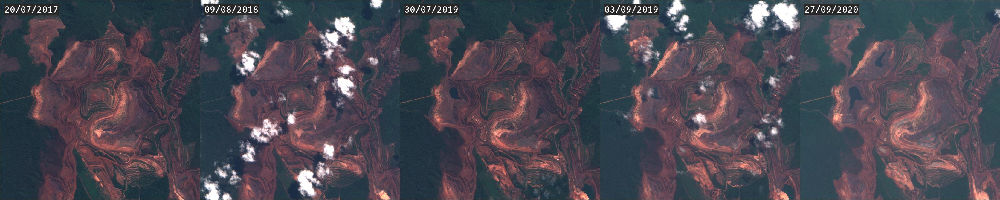
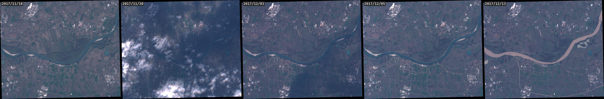

# RaVAEn Workshop at Central Saint Martins
_Workshop at Central Saint Martins on "Machine Learning analysis of climate with satellite data - with Google Earth Engine"_

Part of the **Digital Innovation Season 2022** ([web](https://www.arts.ac.uk/colleges/central-saint-martins/whats-on-at-csm/digital-innovation-season-2022))

**More details on our research project** at https://github.com/spaceml-org/RaVAEn

---

> In this workshop, participants will learn to use machine learning to categorise images, from a dataset of satellite images, with the goal to identify extreme climate events. They will first be presented with recent research on the concepts of ‘remote sensing’, data mining and machine learning models. They will then have hands-on experience of pulling satellite data, analysing multi-spectral images, and differentiating climate-related imagery.
> Participants will learn to access, visualise, and work with satellite data from any location on Earth between two selected dates. They will learn to download multi-spectral Remote Sensing data from the open-access archive of the European Space Agency (ESA) Sentinel-2 mission.
> Through this, they will learn several basic analytical tools of working with these datasets, methods for calculating various useful summative indices (e.g. NDVI) and baseline methods to conduct change detection on a series of images over a targeted area.
> Finally, the workshop will also touch upon a novel deep learning model called RaVAEn to detect disaster events (such as floods, fires, hurricanes).

---

## Example uses:

These are just a few example uses, there are plenty more. Use your imagination, you can access data from anywhere on the entire planet at any time _(if there was a satellite in orbit and clear view without clouds - however even if not, you can get the closest date to it)_.

**Finding yourself:**

**Current events / finding evidence:** [details](https://www.rferl.org/a/satellite-maxar-russia-ukraine-invasion-kyiv-photographs/31749698.html)

**Crop health monitoring:**

**Mining site monitoring:**

**Disaster events tracking, analysis or even prediction:**

